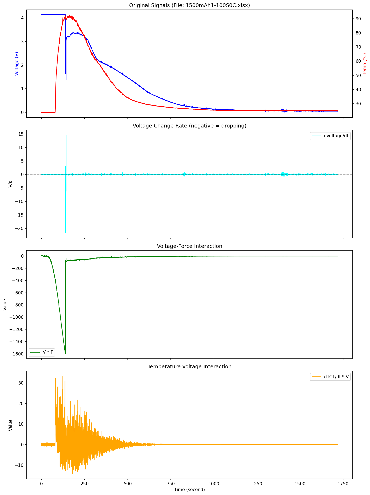
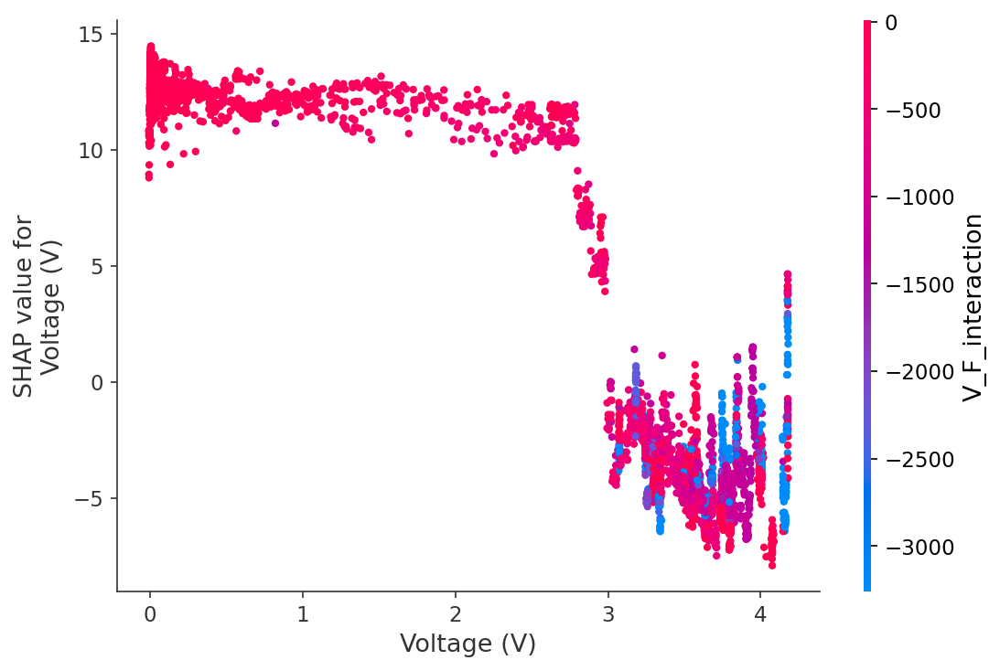
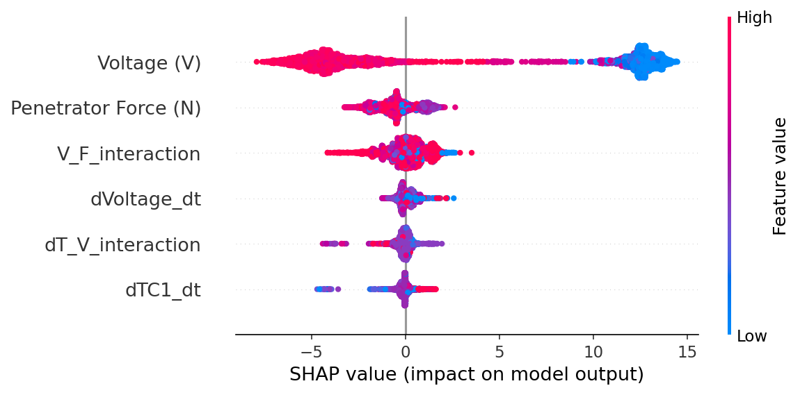
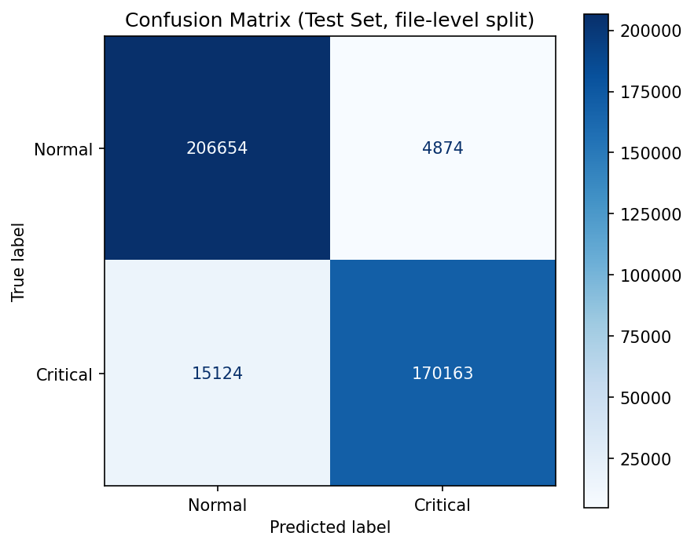
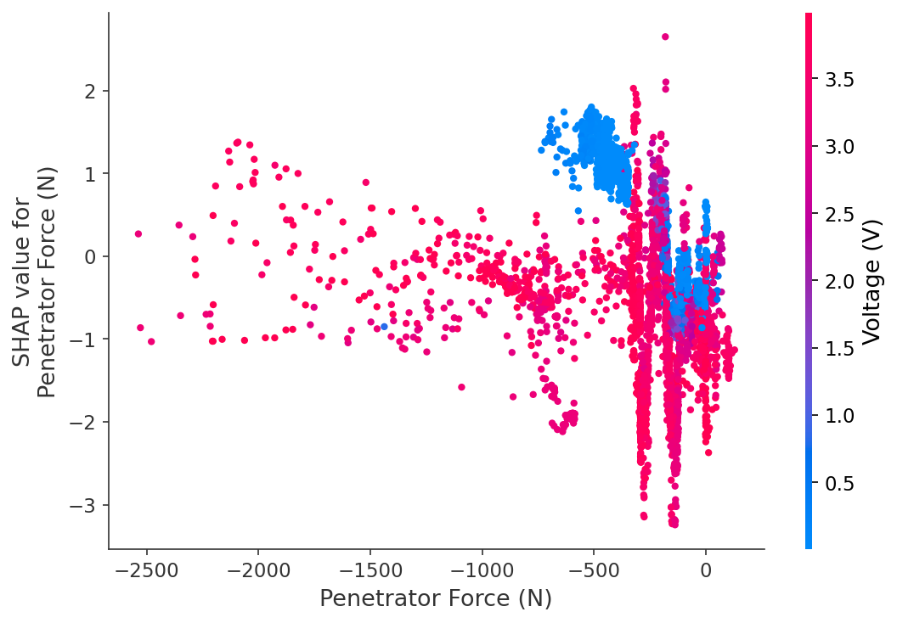

# Early Warning of Lithium-Ion Thermal Runaway — XGBoost Reproduction

A reproduction of Alhasan & Alrashdan (2026), *XGBoost-Powered Predictive Analytics for
Early Identification of Thermal Runaway in Lithium-Ion Batteries*, World Electric Vehicle
Journal 17(68). [doi:10.3390/wevj17020068](https://doi.org/10.3390/wevj17020068)

The pipeline reads 210 mechanical-indentation battery tests, engineers rate-of-change and
interaction features, trains an XGBoost classifier to flag a critical state a few samples
ahead, and explains the result with SHAP.

## Result

| | This reproduction | Paper (Table 2) |
|---|---|---|
| Precision (Critical) | 0.972 | 0.99 |
| Recall (Critical) | 0.918 | 0.98 |
| **F1 (Critical)** | **0.944** | **0.98** |
| Test set | 396,815 rows / 27 files | 734k rows / 42 tests |
| Critical share of test set | 46.7% | 45% |
| Training time | 2.1 s | — |

The paper's headline number reproduces. The class balance lands within two points of what the
paper reports, which is a good sign that the label definition matches. Training 200 trees at
depth 7 takes two seconds, supporting the paper's claim about computational efficiency.

**The more interesting result is what that F1 is actually measuring.** The sections below make
the case that the task, as defined, is close to reading a threshold off one of the input
features, and that the label marks a failed state rather than the failure itself.

## The physical event



One indentation test (`1500mAh1-100S0C.xlsx`, 15,168 samples over 1,719 s, median sampling
interval 0.1 s), before any filtering or labelling. Reading the top panel and measuring the
crossings directly in the raw file:

| Event | Time |
|---|---|
| Temperature rises 5 °C above baseline | 80.8 s |
| Temperature crosses 80 °C | 111.5 s |
| Temperature peaks at 92.9 °C | 137.1 s |
| Voltage first falls below 3.0 V | 138.4 s |
| `dV/dt` first falls below −0.1 V/s | 138.4 s |

Two things follow, and both matter for how the results below should be read.

**The temperature threshold is crossed 26.9 s before the voltage threshold.** Heat is the
leading indicator in this test; the voltage collapse is the consequence. The label is
`V < 3.0 OR TC1 > 80`, so on this cell the label fires on the temperature branch first — and
absolute temperature is not in the feature set. The earliest available warning is precisely the
one the model cannot see.

**"Critical" as the paper defines it is a state, not an event.** In this test the voltage stays
below 3.0 V for 1,282.6 s — **84.6% of the recording**. The voltage is actively collapsing
(`dV/dt < −0.1`) for 29.3 s, **1.93%**. The level-based label marks the entire post-failure
period as critical, which is why the positive class is near-balanced and why predicting it is
easy. The second panel shows this directly: `dVoltage/dt` sits on zero for the whole record
apart from one spike at the moment of collapse.

## What the model actually learned



This is the most informative plot in the repository. SHAP contribution against voltage is a
**step function with its edge at exactly 3.0 V**: around +12 below the threshold, around −5
above it, with a near-vertical transition. The model has not learned a gradual physical
relationship between voltage and risk — it has learned the constant in the label definition.

That follows directly from how the target is built:

```python
Critical = (V < 3.0) OR (TC1 > 80)          # the label
FEATURE_COLS = ['Voltage (V)', ...]          # V is also an input
```

`Voltage (V)` is simultaneously an input feature and, through the 3.0 V threshold, half the
definition of the target. The label is shifted five *samples* forward — half a second in the
test above, and a different duration in every file. So the model is being asked: *given the
voltage now, will the voltage be below 3.0 V half a second from now?* Over that horizon voltage
barely moves, and it has already been below the threshold for most of the record. The question
is close to an identity mapping, and an F1 of 0.944 is what a near-identity mapping scores.



The summary plot says the same thing by a different route. `Voltage (V)` spans roughly −8 to
+15 in SHAP value; every other feature sits inside ±3. One feature carries the decision and the
other five make small corrections.

### A branch of the label with no matching feature

```
Rows over the temperature threshold (TC1 > 80): 118,034
Rows under the voltage threshold (V < 3.0):     637,037
Temperature branch as a share of crossings:     15.6%
```

`TC1 (°C)` appears in the label but not in `FEATURE_COLS` — the feature set contains only its
*rate* of change, `dTC1_dt`. Critical states reached through the temperature branch therefore
have no corresponding input, and the 15.6% of threshold crossings driven by temperature are
invisible to the model by construction. This is a plausible part of why recall (0.918) trails
precision (0.972): the misses concentrate where the model has nothing to look at. The 26.9 s
head start measured above is exactly the signal being discarded.

## Pipeline

| Stage | Detail |
|---|---|
| Load | 210 xlsx files → 3,304,693 rows × 42 columns, cached to parquet |
| Clean | Drop 23 columns missing > 90% of values; linear interpolation within each `file_id` |
| Features | `dTC1_dt`, `dVoltage_dt`, `V_F_interaction`, `dT_V_interaction` — all derivatives computed inside `groupby('file_id')` |
| Filter | Keep files whose initial voltage ≥ 3.0 V → 132 files, 1,814,954 rows |
| Label | `(V < 3.0) OR (TC1 > 80)`, shifted 5 steps forward per file → 40.4% critical |
| Split | File-level, 80/20 → 105 train files (1,417,479 rows) / 27 test files (396,815 rows) |
| Model | `XGBClassifier(learning_rate=0.2, max_depth=7, n_estimators=200)` (paper §3.5) |

Two things in the pipeline are there to stop the result from being meaningless:

- **Every time-series operation is grouped by `file_id`.** An ungrouped `diff()` or `shift()`
  computes rates of change across the boundary between two different cells.
- **The split is by file, not by row.** `train_test_split` would put samples from the same cell
  in both train and test, and the score would be measuring memorisation. The split is asserted
  to have zero overlap.

## Confusion matrix



| | Predicted Normal | Predicted Critical |
|---|---|---|
| **Actual Normal** | 206,654 | 4,874 |
| **Actual Critical** | 15,124 | 170,163 |

15,124 missed critical samples against 4,874 false alarms. For a safety system the
false-negative count is the one that matters, and the model is biased toward missing rather
than over-warning — the opposite of the preferred direction.

## SHAP — dependence on penetrator force



Force contributes within roughly ±3 SHAP, an order of magnitude less than voltage but not
nothing: the blue points (low voltage) near −500 N carry a consistent positive contribution.
Mechanical load does add information beyond the standard BMS signals, which is one of the
paper's stated contributions and the part that holds up best.

## Limitations

- **The prediction horizon is not expressed in seconds.** `shift(-5)` moves the label five
  samples. In the test examined above the median interval is 0.1 s, giving a 0.5 s horizon, but
  that same file contains gaps of up to 2 s and the paper notes intervals as short as 0.045 s
  elsewhere. Five samples is a different duration in every file, so nothing here supports a
  claim of "N seconds of advance warning"; resampling to a fixed rate before shifting is the
  prerequisite for that.
- **Two files share a basename.** The loader reports 210 files read but 209 unique `file_id`s,
  so one pair of distinct tests is merged under a single identifier. Their rows are treated as
  one time series by every `groupby('file_id')` operation and the file-level split cannot
  separate them.
- **The initial-voltage filter retains 132 of 209 files** while reporting that 0 files start
  below 3.0 V. The dataset uses more than one column-naming convention (`Voltage (V)`,
  `Cell Voltage (V)`, `vCell [V]`) and this pipeline reads only the first, so files following
  the other conventions hold NaN in the filter column and are dropped by the `>=` comparison.
  Their exclusion is a side effect of that comparison rather than a judgement about cell health.
- **The label marks a state, not an event.** `V < 3.0` stays true for as long as the cell
  remains collapsed — 84.6% of the test examined above. Additionally requiring an active
  collapse (`dV/dt < −0.1`) would target the failure itself rather than its aftermath. That is
  a different and considerably harder problem, and it is not what the paper measures.
- **A single 80/20 split.** `GroupKFold` grouped by `file_id` would give a more credible
  estimate; the paper acknowledges the same limitation in §4.12.

## Files

```
02_pipeline_EN.ipynb           full pipeline, executed with outputs (English)
02_pipeline_CN.ipynb           same pipeline, Chinese annotations
feature_visualization.png      raw signals and engineered features for one test
confusion_matrix.png           test-set confusion matrix
shap_summary.png               global feature importance
shap_voltage_dependence.png    SHAP vs voltage
shap_force_dependence.png      SHAP vs penetrator force
```

The two notebooks are identical in code and differ only in the language of their comments and
markdown.

## Running it

```bash
pip install pandas numpy scikit-learn xgboost shap matplotlib openpyxl tqdm pyarrow
```

Point `BATTERY_DATA_DIR` at the directory holding the 210 xlsx files, or edit `DATA_DIR` in the
configuration cell, then run all cells. The first run caches the combined frame to
`./cache/combined_raw.parquet`; later runs read the cache in seconds.

`EVALUATE_TEST` in the configuration cell gates every test-set operation. It is `True` here
because the final metrics have been taken, which also means the test set is no longer sealed
and the model should not be tuned further against it.

## Data

Mechanically Induced Thermal Runaway for Li-ion Batteries — 210 mechanical indentation tests
recording voltage, penetrator force, displacement and up to six thermocouple channels.
